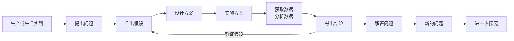

# 第 2 节 实验探究是学习生物学的重要途径

## 实验探究需要合理的思路和方法

生物学实验探究的步骤包括：提出问题、做出假设、设计方案、实施方案、获取数据、分析数据、得出结论。

设计实验方案时，需要遵守以下几个原则：

1. **单一变量原则**：控制无关变量。
2. **重复性原则**：实验需要有一定数量的样本和重复，确保实验数据的可靠。
3. **对照原则**：设置对照组，通过实验组和对照组之间的比较，用统计学等方法确定是否存在差异，从而得出结论。

## 实验探究需要熟练的技能

### 熟悉显微镜各部分的功能

<Figure src="https://upload.wikimedia.org/wikipedia/commons/thumb/3/3a/Optical_microscope_nikon_alphaphot.jpg/500px-Optical_microscope_nikon_alphaphot.jpg?utm_source=zh.wikipedia.org&amp;utm_campaign=imageinfo&amp;utm_content=thumbnail" description='光学显微镜的结构 作者 GcG(jawp) - 自己的作品，公有领域，<a href="https://commons.wikimedia.org/w/index.php?curid=3554424">链接</a>'/>

如图所示，光学显微镜的主要结构包括：

1. 目镜（又称为接目镜或眼透镜）
2. 物镜转换器
3. 物镜
4. 粗准焦螺旋
5. 细准焦螺旋
6. 载物台
7. 光源
8. 聚光器
9. 移动尺

### 低倍镜和高倍镜之间的转换

使用高倍镜观察时，需要先在**低倍镜**下进行观察，将需要观察的细胞移到**通光孔**上方。用目镜观察视野，并用**粗准焦螺旋**将视野调至清晰。

随后，双眼从显微镜**侧面**注视（防止物镜与装片擦碰），并转动**转换器**（**注意，不能直接转动物镜！**）切换到高倍镜。用目镜观察视野，并用**细准焦螺旋**进行微调。若视野光线较暗，可调节光源或聚光器使视野明亮。

### 关于显微镜使用的若干讨论

1. 镜头特征：对于**物镜**而言，放大倍数越大，镜头越**长**；对于**目镜**而言，放大倍数越大，镜头越**短**。
2. 放大倍数：若物镜放大倍数为 $a \times$，目镜放大倍数为 $b \times$，则总放大倍数为 $ab \times$。放大的倍数对两个维度都是线性的，所以是任意方向的长度变大到 $ab \times$ 而非面积。可以类比地图中的比例尺理解。
3. 视野范围：放大倍数越大，视野范围越**小**。从低倍镜切换到高倍镜时，视野内细胞数量变少，物像变大，细胞结构更清晰。
4. 视野亮度：放大倍数越大，视野亮度越**暗**。因为光线通过物镜后，光线的能量被分散到更大的面积上，所以亮度降低。
5. 成像特点：显微镜成像是**倒立的**，即上下颠倒，左右相反（或理解为旋转 $180\degree$）。**顺逆时针方向不变**。

<Figure src="./microscope-image.png" description="显微镜的成像特点，图中分别展示了显微镜下字母 F、胞质环流的成像情况 左侧为原物体，右侧为在显微镜中所成的像"/>
